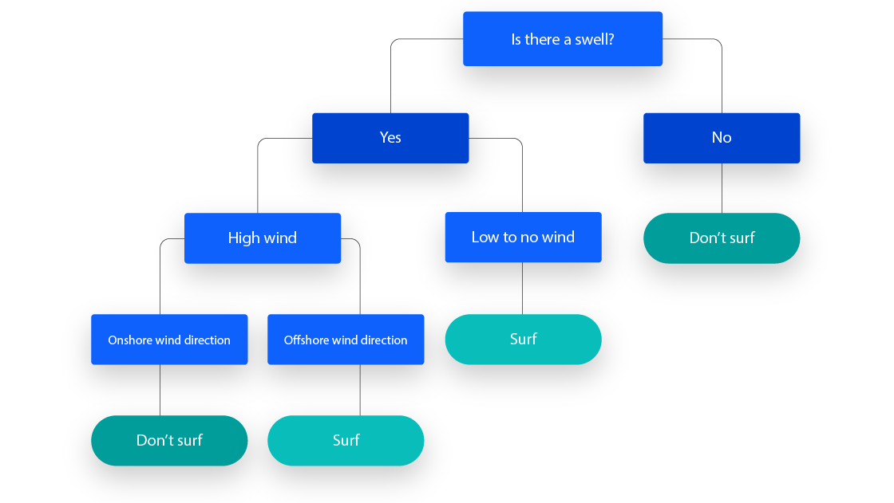

# Decision Trees: Python vs R

A quick and practical guide to decision trees, their fundamentals, and how to implement them in Python and R.



## Table of Contents

1. [Basic Theoretical Explanation](#basic-theoretical-explanation)
2. [Implementation in Python](#implementation-in-python)
3. [Implementation in R](#implementation-in-r)
4. [Comparison: Differences and Similarities](#comparison-differences-and-similarities)
5. [Conclusions](#conclusions)

---

## Basic Theoretical Explanation

Decision trees are supervised algorithms used for both classification and regression problems. Their structure consists of:

- **Root Node:** The starting point containing the entire dataset.
- **Internal Nodes:** Decisions based on a feature of the dataset.
- **Leaves:** Final outcomes or categories.

The main objective is to split the dataset into more homogeneous subsets using decisions based on metrics such as:

- **Gini Impurity**
- **Entropy (ID3, C4.5)**
- **Classification Error**

Visualizing a tree allows for a clear and direct interpretation of the decisions made at each node.

---

## Implementation in Python

The following code implements and visualizes a decision tree in Python using `scikit-learn` and `matplotlib`.

```python
# Import the necessary libraries
from sklearn.datasets import load_iris
from sklearn.model_selection import train_test_split
from sklearn.tree import DecisionTreeClassifier, plot_tree
from sklearn.metrics import confusion_matrix, accuracy_score
import matplotlib.pyplot as plt
import pandas as pd

# Load the 'iris' dataset
iris = load_iris()

# Split the data into training (70%) and testing (30%)
X_train, X_test, y_train, y_test = train_test_split(
    iris.data, iris.target, test_size=0.3, random_state=213
)

# Create the decision tree model
decision_tree = DecisionTreeClassifier(random_state=123)
decision_tree.fit(X_train, y_train)

# Predict the classes for the test data
predictions = decision_tree.predict(X_test)

# Create a confusion matrix
conf_matrix = confusion_matrix(y_test, predictions)
print("Confusion Matrix:\n", conf_matrix)

# Calculate the model's accuracy
accuracy = accuracy_score(y_test, predictions)
print(f"Model Accuracy: {accuracy * 100:.2f}%")

# Visualize the decision tree
plt.figure(figsize=(12, 8))
plot_tree(decision_tree, feature_names=iris.feature_names, class_names=iris.target_names, filled=True)
plt.title("Decision Tree - Iris Dataset")
plt.show()
```


## Implementation in R
The following code implements and visualizes a decision tree in R using rpart and rpart.plot for visualization.
```R
# Install the required packages for decision trees and visualization
install.packages("rpart")
install.packages("rpart.plot")
library(rpart)
library(rpart.plot)

# Load the built-in 'iris' dataset. If unfamiliar, inspect its structure and columns first.
data(iris)

# Split the data into training (70%) and testing (30%) sets. Set the seed to 123 for reproducibility.
set.seed(123)
sample_indices <- sample(1:nrow(iris), 0.7 * nrow(iris))

# Create the training dataset
train_data <- iris[sample_indices, ]

# Create the testing dataset with the remaining rows
test_data <- iris[-sample_indices, ]

# Train the decision tree model using rpart, predicting 'Species' with all features
decision_tree <- rpart(Species ~ ., data = train_data, method = "class")

# Make predictions on the test dataset
predictions <- predict(decision_tree, test_data, type = "class")

# Create a confusion matrix to evaluate performance
conf_matrix <- table(Predictions = predictions, Actual = test_data$Species)
print(conf_matrix)

# Calculate the model's accuracy
accuracy <- sum(diag(conf_matrix)) / sum(conf_matrix)
cat("Model Accuracy:", round(accuracy * 100, 2), "%\n")

# Visualize the decision tree
rpart.plot(decision_tree)
```


## Comparison: Differences and Similarities

| Aspect         | Python                                                              | R                                                              |
|----------------|---------------------------------------------------------------------|----------------------------------------------------------------|
| **Simplicity** | Requires additional configurations for visualization.              | The `rpart.plot` function allows quick and straightforward visualization. |
| **Speed**      | Excellent for large datasets thanks to `scikit-learn`.             | Ideal for in-depth statistical analysis.                      |
| **Community**  | Broad community with extensive resources.                          | Focused on academic and statistical research.                 |

---

## Conclusions

- Both languages are powerful tools for working with decision trees.
- **Python** is more versatile for production projects and handling large datasets.
- **R** excels in exploratory analysis and intuitive visualization.

